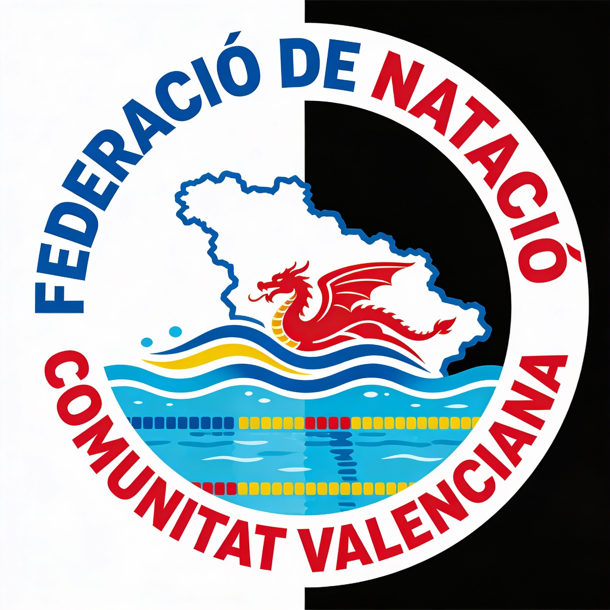

  

# Natación - Gestión de Clubes y Campeonatos

Módulo Odoo 18 para gestionar clubes de natación, nadadores, cuotas, campeonatos y competiciones con resultados automáticos, rankings visuales y generación random de datos para pruebas.

## ✨ Características Principales
- **Clubes Inteligentes**: Rankings dinámicos con medallas (🥇🥈🥉), puntos por resultados y ribbons HTML.
- **Nadadores Completos**: Cálculo de edad/categoría, cuotas con progreso y pago vía SO.
- **Campeonatos Dinámicos**: Wizard de inscripción (valida cuota/club), generador aleatorio de sesiones/eventos/resultados realistas.
- **Clasificaciones Visuales**: Tablas responsive con colores (oro/plata/bronze), mejores tiempos ocultos pero funcionales.
- **Sesiones y Pruebas**: Sin solapamientos, duración auto, ganadores top-3 por evento.
- **Puntos Automáticos**: Sistema 7-5-3-2-1 por rank, actualización en tiempo real.
- **Validaciones Robustas**: Edades no solapadas, cuotas vigentes, constraints Odoo.
- **Wizards y Acciones**: Inscripciones seguras, tickets_qty para PDFs.

## 🎮 Uso Rápido
- Crea clubs/nadadores/categorías.
- Paga cuotas.
- Campeonato > 🪄 Generar Aleatorio.
- ¡Tabla clasificación lista!
